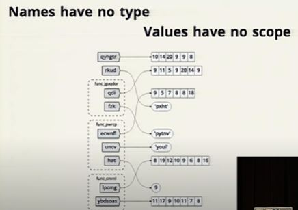

# Pain and Suffering

Over the next 10 weeks of this course, you’ll learn far more than most people learn in 2 years of study in a University setting about software development, web app development, best practices, and the Python language overall.

- Anticipate feeling the pain of grrowth in an accelerated learning enviroment , I will anticipate :
1. Being pushed meatlly
2. Forfing my path mentally 
3. Hours of resarch 
4. Being pushed emotionally
5. Collaborating with new people
6. Being pushed outside my comfort zone 
7. Dealing with uncertainty
8. being pushed physically
9. Losing sleep
- Remember, all growth comes with some degree of pain.
- Pain can be good in the service of growth.

# Beginners Guide to Big O 

- Big o natation: Describes the performance or complexity of an algorithm.
- 0(1): Describes an algorithm that will always execut in the same time or space.Example:

```
bool IsFirstElementNull(IList<string> elements)
{
    return elements[0] == null;
}
```
- O(N): describes an algorithm whose performance will grow linearly and in direct proportion to the size of the input data set. Example:

```
bool ContainsValue(IList<string> elements, string value)
{
    foreach (var element in elements)
    {
        if (element == value) return true;
    }

    return false;
}
```

- O(N2): represents an algorithm whose performance is directly proportional to the square of the size of the input data set. Example:

```
bool ContainsDuplicates(IList<string> elements)
{
    for (var outer = 0; outer < elements.Count; outer++)
    {
        for (var inner = 0; inner < elements.Count; inner++)
        {
            // Don't compare with self
            if (outer == inner) continue;

            if (elements[outer] == elements[inner]) return true;
        }
    }

    return false;
}
```
- Deeper nested iterations will result in O(N3), O(N4) etc.
- O(2N): denotes an algorithm whose growth doubles with each addition to the input data set. Example:
```
int Fibonacci(int number)
{
    if (number <= 1) return number;

    return Fibonacci(number - 2) + Fibonacci(number - 1);
}
```
- Logarithms (O(log N)): The iterative halving of data sets, producing a growth curve that peaks at the start and slowly flattens out.

# Names and Values in Python

